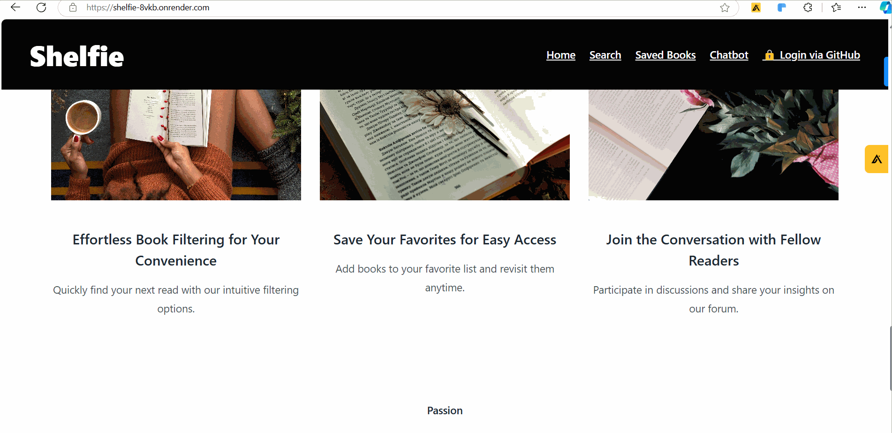
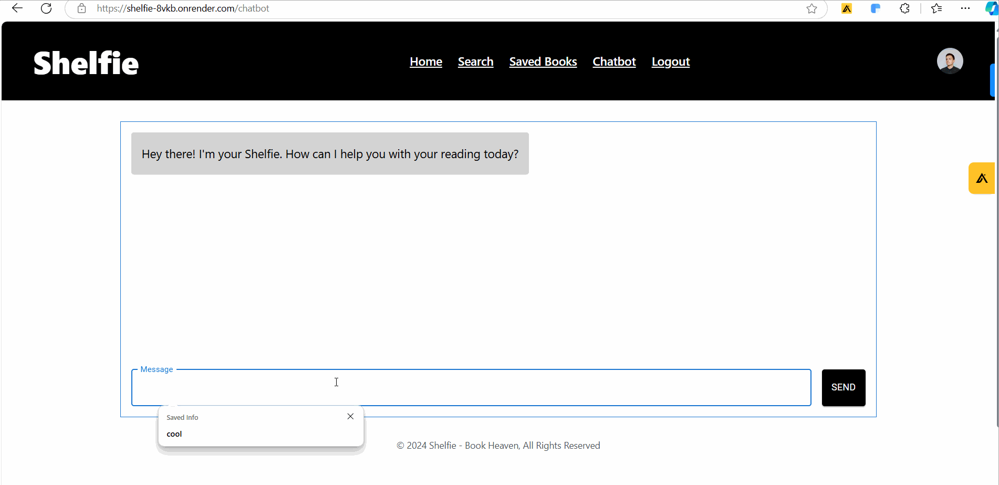

# Shelfie

CodePath WEB103 Final Project

Designed and developed by: Huy Pham, Hiep Nguyen, Hung Luong

🔗 Link to deployed app: https://shelfie-8vkb.onrender.com/

## About

### Description and Purpose

Shelfie is a personalized bookshelf application that helps users search for books, save their favorites, and receive curated recommendations. The app enhances the reading experience by offering book recommendations based on user history and interaction through an LLM-powered chatbot.

### Inspiration

Inspired by the need for a personalized and AI-enhanced reading experience, Shelfie aims to streamline book discovery and provide users with intelligent recommendations.

## Tech Stack

Frontend: React, Tailwind CSS/Vanilla CSS

Backend: Express - Node.js, PostgreSQL, Passport.js, Railway, OpenRouter/Llama3.1

API: Google Books API

## Features

### 1. Book Search Query

✅ Users can search for books by title, with future plans to integrate more advanced search algorithms.



### 2. Account Bookmarking and Recommendation System

Users can save their favorite books, log in and out of their accounts, and benefit from machine learning-based book recommendations trained on their reading history. A relational database PostgreSQL and user authentication system support these features.


### 3. LLM Chatbot for Book Consulting

A language model chatbot offers users personalized book consulting and recommendations, based on their preferences and reading habits.



## Installation Instructions

```
git clone https://github.com/Shelfie-BookShelf-App/main-app.git
cd server npm install
cd ..
cd client npm install
```

In the `client` directory, create a `.env` file with this structure (you'll need to generate your own API key for it to work)

```
VITE_API_KEY = [GOOGLE_BOOKS_API_KEY]
VITE_PUBLIC_OPENROUTER_API_KEY=[OPENROUTER_API_KEY]
```

In the `server` directory, create a `.env` file with this structure (you'll need to generate your own API key for it to work)

```
PG_CONNECTION_STRING=[POSTGRES_CONNECTION_STRING]
GITHUB_CLIENT_ID=[OAuth KEY]
GITHUB_CLIENT_SECRET=[OAuth KEY]
SESSION_SECRET=[ANY STRING CAN GO HERE...]
OPENROUTER_API_KEY=[OPENROUTER_API_KEY]
```

Launch the project on local host:

```
cd client npm run dev
```

then

```
cd server npm start
```
